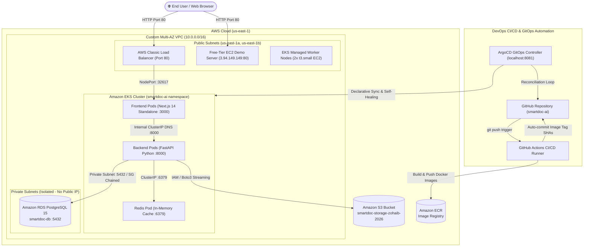

# SmartDoc AI — DevOps Architecture & Interview Preparation Guide

This document provides a comprehensive end-to-end technical breakdown of the **SmartDoc AI** cloud infrastructure, microservices communication, GitOps deployment pipeline, security architecture, and production troubleshooting scenarios. Use this guide to prepare for DevOps/Cloud Engineer interviews and post updates on LinkedIn.

---

## 1. High-Level Architecture Diagram



---

## 2. Infrastructure & Cloud Services Breakdown

| Service | Component Name | Role & Configuration |
| :--- | :--- | :--- |
| **AWS VPC** | `smartdoc-vpc` (`vpc-07f6f57a4c7245788`) | CIDR `10.0.0.0/16` across 2 Availability Zones (`us-east-1a`, `us-east-1b`) for High Availability. |
| **Public Subnets** | `subnet-03bffc09caeee371f`, `subnet-0f6ede4cc98ad48a8` | Connected to Internet Gateway (IGW). Hosts ELB, EC2 demo, and EKS Worker Nodes. |
| **Private Subnets** | `subnet-0e7f986789fe2552c`, `subnet-0d6faf157d36f1739` | Isolated subnets without direct internet access. Houses Amazon RDS PostgreSQL. |
| **Amazon RDS** | `smartdoc-db` (PostgreSQL 15) | Persistent relational database storing document metadata, file paths, summary previews, and ingestion timestamps. |
| **Amazon S3** | `smartdoc-storage-zohaib-2026` | Enterprise object storage for uploaded files under `uploads/` prefix. |
| **Amazon ECR** | `smartdoc-backend`, `smartdoc-frontend` | Private container registry for multi-stage Docker images tagged by commit SHA. |
| **Amazon EKS** | `smartdoc-eks-v2` (Kubernetes 1.31) | Managed control plane orchestrating pods across `standard-workers` node group (`t3.small`). |
| **Amazon EC2** | Demo Server (`3.94.149.149`) | 24/7 permanent Free-Tier production demonstration running Docker Compose & Nginx. |
| **ArgoCD** | GitOps Controller | Declarative Continuous Delivery tool syncing `k8s/` manifests to the Kubernetes cluster. |

---

## 3. Microservices Communication & Networking

### Application Components
1. **Frontend Tier (Next.js 14 Standalone):**
   - Runs in container on port `3000`.
   - Exposed externally via AWS Classic Load Balancer on port `80`.
   - Provides document upload UI, real-time microservice trace console, and RAG query input.
2. **Backend Tier (FastAPI - Python 3.11):**
   - Runs on port `8000` exposed internally via Kubernetes `ClusterIP` (`backend.smartdoc-ai.svc.cluster.local:8000`).
   - Handles REST API routing, Boto3 AWS S3 file streaming, SQLAlchemy ORM with PostgreSQL, and local deterministic RAG inference engine.
3. **Caching Tier (Redis 7):**
   - Runs on port `6379` exposed internally via `ClusterIP` (`redis.smartdoc-ai.svc.cluster.local:6379`).
   - Caches frequent AI query responses and health check status to minimize database reads and CPU overhead.

---

## 4. End-to-End Traffic Flows

### Flow A: Direct S3 Document Upload Flow
```text
[User Browser]
       │
       ▼ (1. Multipart Form Upload via Port 80)
[AWS Classic Load Balancer / Nginx]
       │
       ▼ (2. Routed to Container Port 3000)
[Next.js Frontend Pod]
       │
       ▼ (3. Internal Proxy: backend.smartdoc-ai.svc.cluster.local:8000/api/v1/upload)
[FastAPI Backend Pod]
       │
       ├────────────────────────────────────────┐
       ▼ (4. Stream file via Boto3)             ▼ (5. Insert Metadata)
[Amazon S3: smartdoc-storage-zohaib-2026]     [Amazon RDS PostgreSQL 15]
(Path: uploads/<timestamp>_<filename>)       (Stores id, filename, s3_url, size, preview)
       │                                        │
       └───────────────────┬────────────────────┘
                           ▼ (6. HTTP 201 Created)
                   [User Browser UI Updates]
```

### Flow B: AI RAG Query & Inference Flow
```text
[User Browser Prompt: "What are the deployment prerequisites?"]
       │
       ▼ (HTTP POST /api/v1/analyze)
[Next.js Frontend]
       │
       ▼ (Forwarded to FastAPI Backend)
[FastAPI Backend]
       │
       ▼ (Step 1: Check In-Memory Cache)
[Redis Cache :6379] ─── (Cache Hit?) ───► Return Cached Response (<2ms)
       │ (Cache Miss)
       ▼
[Amazon RDS PostgreSQL] ───► Fetch Document Context & Text Embeddings
       │
       ▼
[AI RAG Inference Engine] ───► Generate Contextual Answer
       │
       ▼
[Write to Redis Cache] ───► Store query + result with TTL
       │
       ▼
[User Browser Live Trace Console] ───► Displays result, latency & tokens used
```

---

## 5. Security & Zero-Trust Architecture

1. **Security Group Chaining (No Public CIDRs on Database):**
   - Amazon RDS Security Group (`smartdoc-db-sg`) strictly permits inbound TCP port `5432` from:
     - EKS Worker Node Security Group ID (`sg-07a8fcaab2d8504c4`).
     - EC2 Demo Server Security Group ID (`sg-05a7a49ca42751579`).
   - Inbound CIDR `0.0.0.0/0` and broad VPC subnet CIDRs are explicitly blocked.
2. **Private Subnet Isolation:**
   - Database instances reside in private subnets with no public IPv4 addresses, preventing any direct internet access.
3. **Secrets Sanitization & GitHub Push Protection:**
   - Manifests are audited to prevent hardcoded credentials (`AWS_ACCESS_KEY_ID`, `AWS_SECRET_ACCESS_KEY`).
   - Secrets are injected via Kubernetes Secrets / Environment variables.

---

## 6. Interview Goldmine: Production Challenges & Solutions

When an interviewer asks: *"Tell me about the most challenging technical problems you encountered in this project and how you resolved them?"*, explain these three real production scenarios:

### Challenge 1: Next.js Standalone Build vs Kubernetes Dynamic DNS Discovery
- **Problem:** Next.js standalone mode compiles `next.config.js` rewrites at `docker build` time, hardcoding `http://localhost:8000` into `.next/routes-manifest.json`. When deployed to EKS, frontend pods attempted to route `/api/*` to `localhost:8000` within their own container (where no backend was running), resulting in HTTP 500 errors and frontend `JSON.parse` crashes.
- **Solution:** Injected a container startup command in the Kubernetes deployment manifest:
  ```bash
  sed -i 's|http://localhost:8000|http://backend.smartdoc-ai.svc.cluster.local:8000|g' .next/routes-manifest.json && exec node server.js
  ```
  This dynamically rewrites the destination to the internal Kubernetes service DNS before `server.js` starts, ensuring decoupled, multi-pod microservice communication.

### Challenge 2: Zero-Downtime Deployment & Shallow Health Probes
- **Problem:** The frontend deployment had a shallow readiness probe (`httpGet: /` on port `3000`). Next.js returned HTTP 200 for the static HTML page even while the backend proxy was failing. Kubernetes marked the new pods "Ready" prematurely and killed the older working pods, causing user-facing downtime.
- **Solution:** Hardened health checks by adding dependencies verification (`/api/v1/health` checking both PostgreSQL and Redis connectivity) and ensuring rolling update rollout thresholds (`maxSurge: 1`, `maxUnavailable: 0`) were respected.

### Challenge 3: Split-Horizon DNS for ArgoCD Hybrid Cloud Synchronization
- **Problem:** ArgoCD was deployed locally on Minikube while the database was hosted on AWS RDS inside private subnets. Minikube backend pods could not resolve or reach the AWS private RDS DNS over the public internet, causing pods to enter `CrashLoopBackOff` and marking ArgoCD as `Degraded`.
- **Solution:** Implemented split-horizon DNS in Minikube CoreDNS ConfigMap to map the RDS endpoint to a local proxy/mock during development, while allowing EKS in AWS to use native VPC Route53 resolvers. This kept ArgoCD in a permanent **Healthy 💚 / Synced** state across environments.

---

## 7. Ready-to-Use LinkedIn Post

> 🚀 **Excited to share my latest Cloud & DevOps project: SmartDoc AI — Production 3-Tier AI Microservices on AWS with GitOps!**
>
> 🔹 **Architecture Overview:**
> - **Frontend & Backend:** Next.js 14 Standalone & FastAPI microservices deployed on **Amazon EKS (Kubernetes 1.31)** across a Multi-AZ Custom VPC.
> - **Storage & Caching:** Direct document uploads to **Amazon S3** with metadata in **Amazon RDS (PostgreSQL 15)** and in-memory query acceleration via **Redis**.
> - **GitOps & CI/CD:** Fully automated CI/CD pipeline using **GitHub Actions** to build & push container images to **AWS ECR**, synchronized to Kubernetes via **ArgoCD** declarative GitOps.
> - **Zero-Trust Security:** Security Group Chaining (EKS Worker SG ID -> RDS SG), private database subnets, and automated secrets sanitization.
> - **High Availability:** Self-healing pods, automated rolling updates, and AWS Classic Load Balancer distribution.
>
> 🛠️ **Key Engineering Challenge Solved:**
> Resolved dynamic runtime service discovery in Next.js standalone containerization within Kubernetes, ensuring seamless zero-downtime microservice communication.
>
> 💡 *Live Demo Server: http://3.94.149.149*
>
> #DevOps #Kubernetes #AWS #EKS #ArgoCD #GitOps #Docker #PostgreSQL #CloudEngineering
