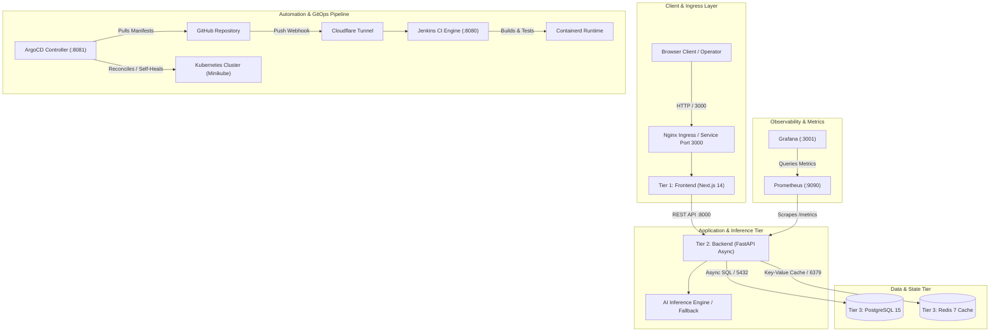

# System Architecture: SmartDoc AI

---

## 1. High-Level Architecture Overview

SmartDoc AI implements a cloud-native **3-Tier Architecture** coupled with an enterprise **DevOps & GitOps Delivery Ecosystem**.



---

## 2. Repository Folder & File Structure

```text
smartdoc-ai/
├── .env                              # Local environment secrets (strictly ignored by Git)
├── .gitignore                        # Git exclusion rules (Secrets, Terraform state, venv, .next)
├── Jenkinsfile                       # Declarative CI/CD pipeline definition
├── README.md                         # Project documentation and quick-start guide
├── architecture.md                   # Full system architecture and component topology
├── design.md                         # UI theme, design system, and visual specs
├── docker-compose.yml                # Phase 2 local 4-service verification stack
├── memory.md                         # Project memory, ADRs, bug logs, and solutions
├── prd.md                            # Product Requirements Document
├── rule.md                           # AI assistant and engineering rulebook
├── setup_devops_environment.sh       # Executable bootstrap runner for Ansible
├── task.md                           # Project phase breakdown and task checklists
│
├── ansible/                          # Phase 1: Infrastructure provisioning
│   ├── inventory.ini                 # Localhost inventory target
│   ├── playbook.yml                  # Playbook entrypoint
│   └── setup_all_devops_dependencies.yml # Automated installation of all DevOps packages
│
├── backend/                          # Tier 2: FastAPI microservice
│   ├── Dockerfile                    # Multi-stage slim build (builder & non-root runner)
│   ├── requirements.txt              # Pinned Python package dependencies
│   └── app/
│       ├── __init__.py
│       ├── main.py                   # FastAPI application entrypoint & middleware
│       ├── core/                     # Configurations & Prometheus telemetry hooks
│       ├── db/                       # SQLAlchemy models & database session manager
│       ├── routers/                  # API endpoints (/health, /documents, /query)
│       └── services/                 # AI inference, Redis caching, PDF parsing
│
├── database/                         # Database bootstrap scripts
│   └── init.sql                      # Initial PostgreSQL schema & seed documents
│
├── frontend/                         # Tier 1: Next.js 14 web dashboard
│   ├── Dockerfile                    # Multi-stage alpine build (deps, builder, runner)
│   ├── jsconfig.json                 # Webpack path alias resolution (@/components)
│   ├── package.json                  # NPM packages (Next.js, React, Tailwind, Lucide)
│   ├── tailwind.config.js            # Tailwind CSS design system tokens
│   └── src/
│       ├── app/
│       │   ├── globals.css           # Global styles and Dark Slate design variables
│       │   ├── layout.jsx            # HTML root layout wrapper
│       │   └── page.jsx              # Main interactive dashboard UI
│       └── components/               # Modular components (FileUpload, AIConsole)
│
├── k8s/                              # Kubernetes manifests & GitOps configurations
│   ├── argocd-application.yaml       # Declarative ArgoCD Application CRD
│   ├── backend.yaml                  # Backend Deployment (2 replicas), Service, Secret, ConfigMap
│   ├── frontend.yaml                 # Frontend Deployment (2 replicas), NodePort Service
│   ├── ingress.yaml                  # Nginx Ingress routing (/api, /metrics, /)
│   ├── namespace.yaml                # Dedicated namespace (smartdoc-ai)
│   ├── postgres.yaml                 # PostgreSQL Deployment, PVC (1Gi), Service, ConfigMap
│   └── redis.yaml                    # Redis Deployment and ClusterIP Service
│
├── monitoring/                       # Telemetry & Observability stack
│   ├── PROMETHEUS_GRAFANA_GUIDE.md   # Comprehensive handbook for Prometheus, Grafana & SRE
│   ├── docker-compose.monitoring.yml # Standalone Compose stack for monitoring
│   ├── grafana/
│   │   └── provisioning/
│   │       └── datasources/
│   │           └── prometheus.yml    # Auto-provisioned Prometheus data source
│   └── prometheus/
│       └── prometheus.yml            # Scrape configuration for backend target (:8000)
│
└── terraform/                        # Phase 3: Infrastructure as Code
    ├── main.tf                       # Kubernetes provider resources (Namespace, Secrets, ConfigMaps)
    ├── outputs.tf                    # Provisioned resource outputs
    └── variables.tf                  # Configurable inputs and environment variables
```

---

## 3. Component Interconnection & Network Topology

| Component | Technology | Internal Port | External Access | Communicates With |
| :--- | :--- | :--- | :--- | :--- |
| **Frontend** | Next.js 14 Standalone | `3000` | `http://localhost:3000` (via Port-Forward or Ingress) | Backend (`:8000`) |
| **Backend** | FastAPI + Uvicorn | `8000` | `http://localhost:8000` (`/api/v1`, `/docs`) | PostgreSQL (`:5432`), Redis (`:6379`) |
| **Database** | PostgreSQL 15 Alpine | `5432` | Cluster internal (`postgres.smartdoc-ai.svc:5432`) | Backend |
| **Cache** | Redis 7 Alpine | `6379` | Cluster internal (`redis.smartdoc-ai.svc:6379`) | Backend |
| **Prometheus** | Prometheus v2.51 | `9090` | `http://localhost:9090` | Backend `/metrics` endpoint |
| **Grafana** | Grafana v10.4 | `3000` ➔ `3001` | `http://localhost:3001` | Prometheus data source |
| **Jenkins** | Jenkins LTS | `8080` | `http://localhost:8080` & Public Cloudflare Tunnel | GitHub, Docker daemon, Minikube Containerd |
| **ArgoCD** | ArgoCD v3.5 | `8080` ➔ `8081` | `https://localhost:8081` | GitHub repository (`k8s/`), Kubernetes API |

---

## 4. End-to-End Data Flow Lifecycles

### 4.1. Document Query & Ingestion Flow
1. **User Action**: The client uploads a PDF document via the Next.js frontend (`FileUpload.jsx`).
2. **Ingestion Request**: Frontend dispatches a `multipart/form-data` POST request to `/api/v1/documents/upload`.
3. **Parsing & Storage**:
   - Backend extracts text chunks using `pypdf`.
   - Document metadata and content are committed to PostgreSQL (`documents` table).
4. **AI Query Execution**:
   - Client sends prompt to `/api/v1/query`.
   - Backend hashes the prompt (`SHA-256`) and checks Redis cache.
   - **Cache Hit (< 15ms)**: Cached answer returned immediately.
   - **Cache Miss (< 1200ms)**: Query evaluated against document context via AI inference service, result cached in Redis with a 3600-second TTL.
5. **Telemetry Recording**:
   - Prometheus FastAPI Instrumentator automatically increments `http_requests_total` and records client latency in `http_request_duration_seconds`.

---

### 4.2. GitOps Continuous Delivery Flow
1. Developer pushes code to GitHub `main` branch.
2. Cloudflare Tunnel receives the GitHub POST webhook and routes it to Jenkins on port `8080`.
3. Jenkins runs:
   - Linting (`hadolint`).
   - Multi-stage Docker builds.
   - Local smoke test on isolated container port `8001`.
   - Saves and streams images directly into Minikube Containerd: `docker save | ctr images import`.
4. ArgoCD continuously monitors the `k8s/` directory in GitHub:
   - Detects state synchronization.
   - Compares live cluster with desired Git manifests.
   - Self-heals any unauthorized manual drifts within milliseconds.
