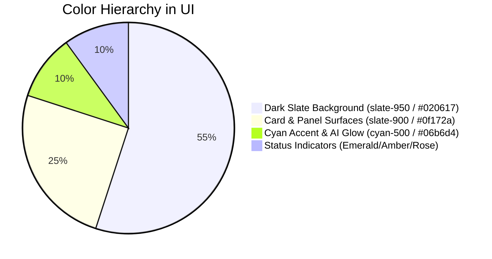

# Design System & UI Specifications: SmartDoc AI

---

## 1. Design Aesthetics & Visual Philosophy

SmartDoc AI features an **Enterprise Dark Slate** visual theme designed for mission-critical operations, AI telemetry monitoring, and high readability. It incorporates glassmorphism, subtle micro-animations, and status-driven chromatic feedback.

* **Primary Philosophy**: High-contrast, sleek dark mode tailored for developers and operations teams.
* **UI Framework**: Tailwind CSS with custom utility components.
* **Component Library**: Custom modular React components + Lucide Icons.

---

## 2. Color Palette & Design Tokens



### 2.1. Surface & Background Tokens
| Token | Hex Value | Usage |
| :--- | :--- | :--- |
| `bg-slate-950` | `#020617` | Main Application Canvas & Shell |
| `bg-slate-900` | `#0f172a` | Cards, Panels, Navigation Headers, and Dropdowns |
| `border-slate-800` | `#1e293b` | Structural borders, card outlines, and dividers |
| `bg-slate-900/60` | `rgba(15, 23, 42, 0.6)` | Frosted glassmorphism navigation bar (`backdrop-blur-md`) |

### 2.2. Accent & State Tokens
| Token | Hex Value | Semantic Meaning |
| :--- | :--- | :--- |
| `text-cyan-400` / `bg-cyan-500` | `#22d3ee` / `#06b6d4` | Primary brand accent, active tabs, buttons, AI inference glow |
| `text-emerald-400` / `bg-emerald-950` | `#34d399` / `#064e3b` | Healthy state, successful database/cache connections, synced status |
| `text-amber-400` / `bg-amber-950` | `#fbbf24` / `#451a03` | Degraded state, high latency warning, caching fallback |
| `text-rose-500` / `bg-rose-950` | `#f43f5e` / `#4c0519` | Connection error, circuit-breaker tripped, invalid upload |
| `text-violet-400` / `bg-violet-950` | `#a78bfa` / `#2e1065` | AI vector generation and LLM token processing badge |

---

## 3. Typography & Font Hierarchy

* **Primary Sans-Serif**: `Inter`, `-apple-system`, `BlinkMacSystemFont`, `Segoe UI`, `Roboto`
  * Applied to headings, labels, buttons, and dashboard cards.
* **Monospace Engine**: `JetBrains Mono`, `Fira Code`, `ui-monospace`, `Courier New`
  * Applied to real-time microservice logs, status badges, ports, commit hashes, and JSON outputs.

| Hierarchy | Tailwind Classes | Purpose |
| :--- | :--- | :--- |
| **Header Title** | `text-lg font-bold tracking-tight text-white` | Top bar platform title |
| **Section Heading** | `text-base font-semibold text-slate-100` | Card titles (Document Ingestion, AI Console) |
| **Status Pills** | `text-[10px] uppercase font-mono px-2 py-0.5 rounded-full` | Live connection badges (`Postgres: connected`) |
| **Terminal Logs** | `text-xs font-mono text-slate-300 leading-relaxed` | Real-time trace logs in AI console |

---

## 4. UI Layout & Component Specifications

```text
+-----------------------------------------------------------------------------------+
|  [Logo] SmartDoc AI   [Badge: Production Live V3.0 (GitOps)]  | Postgres: OK | Redis: OK |
+-----------------------------------------------------------------------------------+
|  [ Architecture Banner: Tier 1 (Next.js) -> Tier 2 (FastAPI) -> Tier 3 (DB/Cache) ] |
+--------------------------------------------------+--------------------------------+
|  DOCUMENT INGESTION & REPOSITORY                |  AI INFERENCE OUTPUT & STREAM  |
|                                                  |                                |
|  +--------------------------------------------+  |  +--------------------------+  |
|  |       Drag & Drop Upload Zone (PDF, TXT)   |  |  |  [Mode: QA | Summary]    |  |
|  +--------------------------------------------+  |  |                          |  |
|                                                  |  |  Inference Response Box  |  |
|  Uploaded Files Table:                           |  |  Tokens Used, Latency    |  |
|  - README.md (Active)                            |  |                          |  |
|  - smartdoc_spec.txt                             |  +--------------------------+  |
+--------------------------------------------------+--------------------------------+
|  MICROSERVICE LIVE TRACE CONSOLE (WebSocket / Event Stream)                       |
|  [INFO] NextJS: Connected to FastAPI backend on port 8000                          |
|  [METRIC] Prometheus: Client request latency 12ms                                  |
+-----------------------------------------------------------------------------------+
```

### 4.1. Key Interactive Components
1. **Interactive Dropzone**:
   - Dashed border with subtle hover pulse animation.
   - Dynamic file validation with instant size feedback.
2. **Analysis Mode Selector**:
   - Segmented toggle pills for `QA`, `Summarize`, and `Fact-Check`.
   - Active state accented with `bg-cyan-500/20` and `border-cyan-400`.
3. **Live Trace Console**:
   - Simulated real-time streaming telemetry with colored level badges (`INFO`, `METRIC`, `ERROR`).
   - Sticky bottom layout with auto-scroll preservation.
