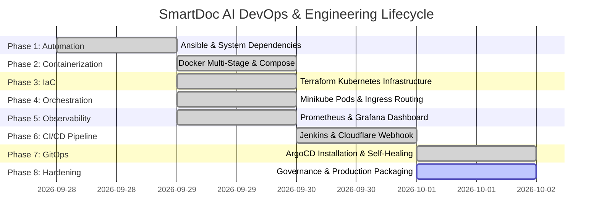

# Project Task Tracker & Execution Roadmap: SmartDoc AI

---

## 1. Project Phase Breakdown & Status Overview

---

## 2. Detailed Task Checklists

### ✅ Phase 1: Dependencies & System Bootstrapping
- [x] Create automated Ansible playbook: [`ansible/setup_all_devops_dependencies.yml`](file:///home/harry/Devops/Projects/smartdoc-ai/ansible/setup_all_devops_dependencies.yml).
- [x] Package unattended installers for Docker, Docker Compose, Kubectl, Minikube, Terraform, and Helm.
- [x] Create executable shell wrapper: [`setup_devops_environment.sh`](file:///home/harry/Devops/Projects/smartdoc-ai/setup_devops_environment.sh).
- [x] Verify non-interactive execution on Debian/Ubuntu Linux.

### ✅ Phase 2: Containerization & Local Verification
- [x] Write multi-stage, slim Dockerfile for FastAPI backend with `/opt/venv` and `appuser` (UID 1001).
- [x] Write multi-stage, standalone Dockerfile for Next.js frontend with `nextjs` (UID 1001).
- [x] Fix Next.js Webpack path resolution via [`frontend/jsconfig.json`](file:///home/harry/Devops/Projects/smartdoc-ai/frontend/jsconfig.json).
- [x] Create 4-tier local Docker Compose stack: [`docker-compose.yml`](file:///home/harry/Devops/Projects/smartdoc-ai/docker-compose.yml).
- [x] Verify local inter-service networking and health probes across all 4 containers.

### ✅ Phase 3: Infrastructure as Code (IaC)
- [x] Write declarative Terraform configurations in [`terraform/`](file:///home/harry/Devops/Projects/smartdoc-ai/terraform).
- [x] Provision Kubernetes namespace `smartdoc-ai`.
- [x] Provision ConfigMap `backend-config` and Secret `backend-secret`.
- [x] Execute `terraform init`, `terraform plan`, and `terraform apply -auto-approve`.

### ✅ Phase 4: Kubernetes Orchestration & Ingress Routing
- [x] Start Minikube cluster with Docker driver (`minikube start --driver=docker`).
- [x] Enable Minikube Ingress addon (`minikube addons enable ingress`).
- [x] Author declarative manifests in [`k8s/`](file:///home/harry/Devops/Projects/smartdoc-ai/k8s):
  - [x] [`namespace.yaml`](file:///home/harry/Devops/Projects/smartdoc-ai/k8s/namespace.yaml)
  - [x] [`postgres.yaml`](file:///home/harry/Devops/Projects/smartdoc-ai/k8s/postgres.yaml) (with 1Gi PVC)
  - [x] [`redis.yaml`](file:///home/harry/Devops/Projects/smartdoc-ai/k8s/redis.yaml)
  - [x] [`backend.yaml`](file:///home/harry/Devops/Projects/smartdoc-ai/k8s/backend.yaml) (2x replicas, probes)
  - [x] [`frontend.yaml`](file:///home/harry/Devops/Projects/smartdoc-ai/k8s/frontend.yaml) (2x replicas, NodePort)
  - [x] [`ingress.yaml`](file:///home/harry/Devops/Projects/smartdoc-ai/k8s/ingress.yaml)
- [x] Verify all 6 pods reached `1/1 Running` and healthy.

### ✅ Phase 5: Telemetry & Observability
- [x] Instrument FastAPI backend with `prometheus-fastapi-instrumentator`.
- [x] Configure Prometheus scrape target in [`monitoring/prometheus/prometheus.yml`](file:///home/harry/Devops/Projects/smartdoc-ai/monitoring/prometheus/prometheus.yml).
- [x] Configure automated Grafana datasource provisioning in [`monitoring/grafana/provisioning/datasources/prometheus.yml`](file:///home/harry/Devops/Projects/smartdoc-ai/monitoring/grafana/provisioning/datasources/prometheus.yml).
- [x] Launch monitoring stack via [`monitoring/docker-compose.monitoring.yml`](file:///home/harry/Devops/Projects/smartdoc-ai/monitoring/docker-compose.monitoring.yml) using `network_mode: "host"`.
- [x] Build and verify live visual monitoring dashboard in Grafana at `http://localhost:3001`.
- [x] Author comprehensive Enterprise Prometheus & Grafana Mastery Guide: [`monitoring/PROMETHEUS_GRAFANA_GUIDE.md`](file:///home/harry/Devops/Projects/smartdoc-ai/monitoring/PROMETHEUS_GRAFANA_GUIDE.md).

### ✅ Phase 6: CI/CD Pipeline Automation
- [x] Deploy containerized Jenkins (`smartdoc-jenkins`) mounting Docker socket and Minikube kubeconfig.
- [x] Fix Jenkins Docker network isolation: connect Jenkins to Minikube network with static IP (`192.168.49.100`).
- [x] Write 5-stage declarative pipeline in [`Jenkinsfile`](file:///home/harry/Devops/Projects/smartdoc-ai/Jenkinsfile):
  - Stage 1: Code Checkout & Hadolint Linting.
  - Stage 2: Multi-stage Docker Builds.
  - Stage 3: Isolated Ephemeral Smoke Test on port 8001.
  - Stage 4: Containerd Stream Import & Manifest Application.
  - Stage 5: Zero-downtime Rollout Verification.
- [x] Deploy Cloudflare Tunnel for secure HTTPS ingress to `localhost:8080`.
- [x] Configure GitHub Webhook and verify automatic 0-second push-to-build triggers (Build #9 passed).

### ✅ Phase 7: GitOps & Automated Self-Healing (ArgoCD)
- [x] Install ArgoCD operator inside Minikube (`kubectl create ns argocd`).
- [x] Expose ArgoCD dashboard on `https://localhost:8081`.
- [x] Create declarative ArgoCD application: [`k8s/argocd-application.yaml`](file:///home/harry/Devops/Projects/smartdoc-ai/k8s/argocd-application.yaml).
- [x] Enable automated synchronization, resource pruning, and **Self-Healing**.
- [x] Refactor `Jenkinsfile` to remove direct `kubectl apply` commands and delegate deployment to ArgoCD.
- [x] Conduct live drift testing: Verify unauthorized `kubectl scale` commands are instantly reverted by ArgoCD.

---

### ⏳ Phase 8: Production Hardening & Documentation (In Progress)
- [x] Standardize repository governance documents (`prd.md`, `architecture.md`, `rule.md`, `design.md`, `task.md`, `memory.md`).
- [ ] Add Helm / Kustomize environment overlays (`overlays/dev`, `overlays/prod`).
- [ ] Configure ArgoCD Slack/Discord webhook alerts for automated drift notifications.
- [ ] Finalize GitHub portfolio release notes and demonstration video.
